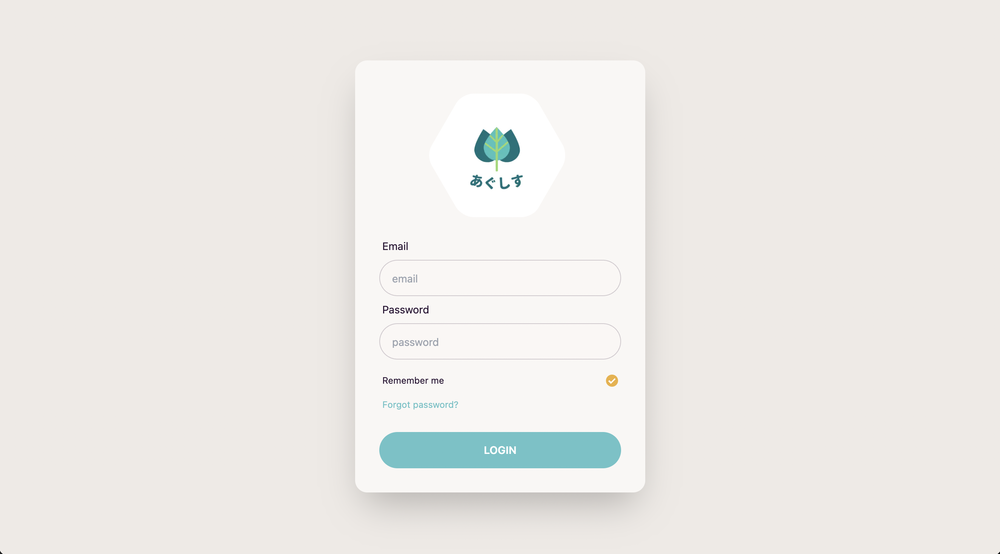

# agusys-Web

## Web 版あぐしす

    

### 用途

- LINEbot 版あぐしすにより記録したデータの確認

### できること

- 農地に紐づく写真およびテキストの表示（予定）
- CSV データのダウンロード（予定）

### URL

:seedling: https://agusys.vercel.app/

### 開発環境

- Next.js
- TypeScript / Eslint / Prettier
- tailwindcss / daisyUI
